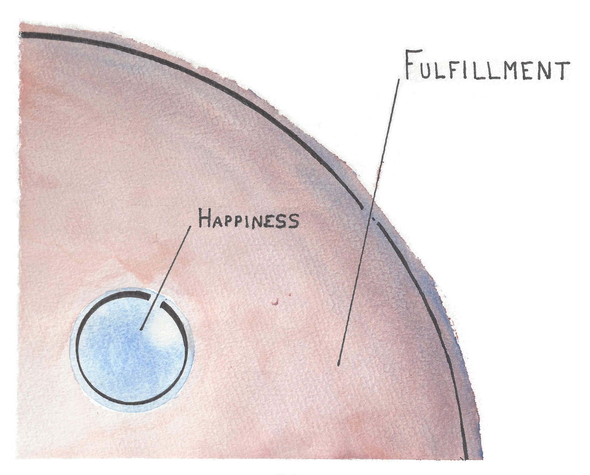

Last weekend, I helped create magic during the inaugural session of [Camp Wonderful](www.campwonderful.com). It was stressful, it was messy, it was beautiful, it was perfect. I arrived at camp eager to work with some acquaintances; I left with a dozen friendships that I’m confident will last a lifetime.

At camp we agree not to talk about work, but one item of chit-chat that comes up continually is “where do you live,” the underlying sentiment of which is “oh my god I have the largest friend crush on you and please please please let it be a city near mine so that we can hang out all the time”. My answer to this question isn’t as straightforward as most, but it goes something like: “mostly San Francisco, Brooklyn, and Vermont.” I give this response, subsequently clarifying my current living arrangements, and eventually the conversation reaches a crucial question: “why are you doing that?” This question is interesting if only because it is intensely personal; many people can envision the reasons why _they_ would (or would not) choose to live nomadically, but those reasons are divorced from the curiosity of understanding another person’s motivations.

My answer, six months into this way of living, remains opaque at best. It has only been through the journey itself that I’ve begun to understand my incentives. As in the scientific method, my current experiment requires curiosity alone. To my great pleasure, the experience is gradually yielding more personal discovery than I initially sought.

Last month I listened to [Krista Tippet’s conversation with Matthieu Ricard](https://onbeing.org/programs/matthieu-ricard-happiness-as-human-flourishing-jul2017/) in which Ricard discusses his understanding of happiness. He suggests that happiness is not an emotion as much as it is a way of being; a toolkit that helps you process a full spectrum of feelings rather than an emotional response to present circumstances.

> “[I] think of happiness as a way of being […] that gives you the resources to deal with the ups and downs of life, that pervades all the emotional states, including sadness. [Happiness can] encompass every mental state except those who are just opposite, which is like despair, hatred, precisely the mental factors that will destroy inner peace, inner strength, inner freedom. If you are under the grip of hatred, you are not free. You are the slave of your own thoughts. So that’s not freedom. Therefore, this is opposite to genuine flourishing and happiness.”

I spent the week before camp in Bushwick, and on a quiet Sunday night I sat, painting, illustrating to life some choice memories from my most recent stint in San Francisco. As I started to fade, flushed with exhaustion from a wedding the night before, I made one more painting. It was an afterthought, but the sentiment of it resonated strongly with me.

There are aspects of nomadic living that I’ve found to be wholly unpleasant. One is the necessary fragmenting of a subset of friendships; people I previously saw daily are now inaccessible for large swaths of time, and video calls are a poor substitute for the warmth and connection of being together in a physical space. Another is a persistent, nagging sense of loneliness. Not for a lack of social interaction—if anything I’ve had far _more_ since March when I started prioritizing socializing over solitude—but rather an inherent disconnect between the track my life is on as compared to others. The loneliness, if given a voice, would ask “why aren’t you settling somewhere?” and tell me “you’re making your life more difficult.” On some days, that voice holds more truth than I would prefer to hear.

Unpleasantries aside, I would be a fool not to acknowledge the incredible opportunities for growth that the past six months have presented. Impermanent living situations, not surprisingly, allow for expansion of ones social network at a rate far quicker than normal. New people offer new ideas and new avenues for personal exploration. I can now recognize that I am in transition, and that I’m starting to catch occasional glimpses of the elusive Next Thing™. It feels gratifying.

Nevertheless, these contradictory experiences make it difficult to negotiate the chasm between what feels uncomfortable and what I blindly trust will be a worthwhile venture.

The stability I left behind in San Francisco was—at least by our culturally ascribed definition of happiness as hedonism, comfort, and contentment—a happy one. It was hard _not_ to feel happy when my predominant activities included drinking wine with friends, working a cushy job, and getting high in the park on weekends. It is also important to acknowledge that if hedonistic pleasure is my (but I will posit here that this applies to a collective “we” as well) primary cognitive diet, I will eventually become malnourished by a lack of introspection and activities that challenge my brain, that challenge me to keep learning and evolving.

In my cursory illustration, I was attempting to remind myself that happiness, as understood by its common definition of “a feeling of contentment,” is but a small percentage of what helps us find balance and, ultimately, fulfillment. It is okay to feel sadness. It can be productive to feel lonely. There is value in sifting through discontent.

And so I continue.
