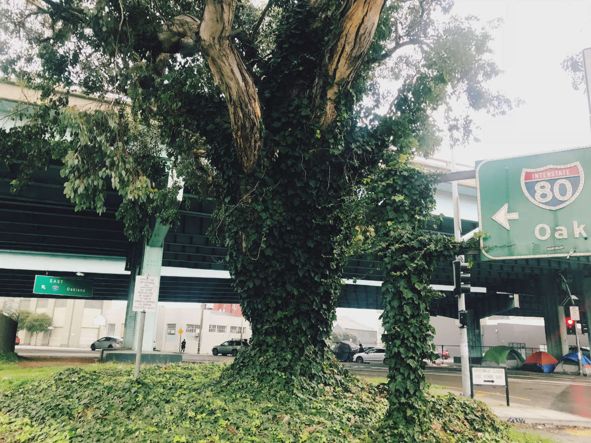
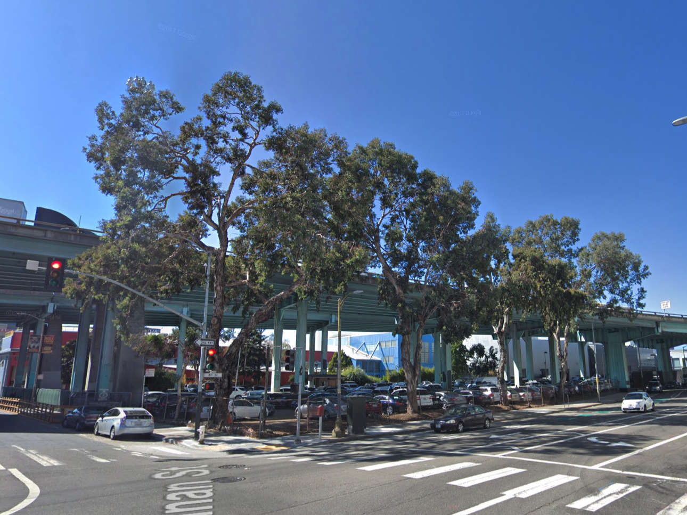

It’s easy to overlook trees in urban space. I don’t mean saplings—their skinny stalks so often the hallmark of new development and urban renewal projects—but rather big, old trees. Trees that predate the buildings they are flanked by.

Trees like this are easy to miss largely because they are sparse, with their ranks growing ever smaller in what seems to be a tree’s inevitable fate in a maturing city.

There exists such a tree on the corner of 8th and Bryant Street, in San Francisco. I’ve passed it on my way to work for four years and only today, for the first time, did I truly see it. It’s massive, evoking fairytales, mangled and knobby. Ivy grows like a skirt around its base and has climbed so far up the trunk so that the bark is lost beneath. It is wonderfully conspicuous, surrounded by acres of concrete and asphalt, hunched beneath a behemoth steel freeway overpass.

Last summer, I noticed a row of similar trees, up the block at 8th and Brannan Street, lining the edge of a car dealership. Despite having passed this intersection countless times, I suddenly noticed the way that these two trees provided a beautiful shade and blocked from view the unsightly highway overhead. Only days later, I approached the intersection and heard the chainsaw just as I noticed the gaping void left by the felling of those trees.

If you live in a city long enough, this becomes a familiar occurrence; green things and open space are replaced by a building or excised for development. When I first moved to San Francisco, the intersection at Hayes and Laguna Street, in Hayes Valley, was full of light thanks to a large patio attached to the restaurant there. A block south on Laguna Street was a full city block of community gardens. Both spaces, six years later, are lego block condos that blot out the sun, one and two bedroom units that start at $950k, with the larger units going for an astounding $1.65MM.

Sadly, it appears that the two trees at 8th and Brannan Street were taken not to make way for housing, or even a renewal project, but to fit a handful of extra cars into the corner of a parking lot. Maybe the trees were dropping debris and damaging the vehicles. Whatever the case, their removal struck me as both typical and heartbreaking; it was only days earlier that I had noticed them for the first time. It is hard to accept that you’ve been overlooking beauty in your midst, but harder still to see it destroyed.

The ivy wrapping the tree at Bryant Street, while beautiful, is likely killing the tree, if it hasn’t already succeeded in doing so. I tried without success to find old photos of the intersection, hoping to see the tree appear in a snapshot from the early 20th century. The closest result shows [8th and Harrison Street in 1936](http://www.oldsf.org/#ll:37.773762%7C-122.408518&e:AAB-4042%7C597&m:37.77241%7C-122.40533%7C17); train rails stretch away into the distance; the street is sparsely populated by factory buildings. What transformations you’ve seen, ivy giant; how stoically you weather the weather while your roots still grow.

Seeing these elders, and acknowledging their presence, is a simple way to be mindful on an urban walk. Their presence reminds me that I am small; that we share our space with a million living things that are not humans.
